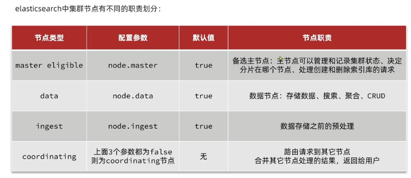

<!-- TOC -->
  * [十. 分布式搜索---elasticsearch](#十-分布式搜索---elasticsearch)
    * [1. 初识elasticsearch](#1-初识elasticsearch)
    * [2. 索引库操作](#2-索引库操作)
      * [(1). mapping映射属性](#1-mapping映射属性)
      * [(2). 索引库的CRUD](#2-索引库的crud)
      * [A. 创建索引库 请求内容用DSL语句表示](#a-创建索引库-请求内容用dsl语句表示)
      * [B. 查看删除索引库](#b-查看删除索引库)
      * [C. 增加索引库字段](#c-增加索引库字段)
    * [3. 文档操作](#3-文档操作)
      * [A. 新增文档](#a-新增文档)
      * [B. 查看文档](#b-查看文档)
      * [C. 删除文档](#c-删除文档)
      * [D. 修改文档](#d-修改文档)
    * [4. RestClient操作索引库(RestAPI)](#4-restclient操作索引库restapi)
      * [A. 创建索引库](#a-创建索引库)
      * [B. 初始化JavaRestClient](#b-初始化javarestclient)
      * [c. 创建索引库](#c-创建索引库)
      * [d. 删除索引库和判断索引库是否存在](#d-删除索引库和判断索引库是否存在)
    * [4. RestClient操作文档](#4-restclient操作文档)
  * [十一. 分布式搜索---DSL查询](#十一-分布式搜索---dsl查询)
    * [1. DSL查询文档](#1-dsl查询文档)
      * [(1). DSL查询分类](#1-dsl查询分类)
    * [2. DSL查询结果处理](#2-dsl查询结果处理)
      * [(1). 排序](#1-排序)
      * [(2). 分页](#2-分页)
      * [(3). 高亮](#3-高亮)
    * [3. RestClient查询文档](#3-restclient查询文档)
      * [(1). 简单查询](#1-简单查询)
      * [(2). 全文检索查询](#2-全文检索查询)
      * [(3). 精确查询](#3-精确查询)
      * [(4). 符合查询-boolean query](#4-符合查询-boolean-query)
    * [3. RestClient排序和分页文档](#3-restclient排序和分页文档)
    * [3. RestClient高亮文档](#3-restclient高亮文档)
    * [4. 旅游案例](#4-旅游案例)
      * [(1). 酒店搜索和分页](#1-酒店搜索和分页)
      * [(2). 酒店结果过滤](#2-酒店结果过滤)
      * [(3). 周边酒店](#3-周边酒店)
      * [(4). 酒店竞价排名](#4-酒店竞价排名)
* [十二. 分布式搜索引擎高级](#十二-分布式搜索引擎高级)
  * [1. 数据聚合](#1-数据聚合)
    * [(1). 聚合的种类](#1-聚合的种类)
    * [(2). DSL实现聚合](#2-dsl实现聚合)
      * [a. Bucket聚合](#a-bucket聚合)
      * [b. DSL实现Metrics聚合](#b-dsl实现metrics聚合)
    * [(3). RestAPI实现聚合](#3-restapi实现聚合)
    * [(4). 在IUserService中定义方法, 实现对品牌, 城市, 星级的聚合](#4-在iuserservice中定义方法-实现对品牌-城市-星级的聚合)
  * [2. 自动补全](#2-自动补全)
    * [(1). 安装拼音分分词器`https://github.com/medcl/elasticsearch-analysis-pinyin`](#1-安装拼音分分词器httpsgithubcommedclelasticsearch-analysis-pinyin)
    * [(2). 自定义拼音分词器](#2-自定义拼音分词器)
    * [(3). 自动补全---completion suggester查询](#3-自动补全---completion-suggester查询)
      * [实现hotel索引库的自动补全, 拼音搜索功能](#实现hotel索引库的自动补全-拼音搜索功能)
  * [3. 数据同步](#3-数据同步)
    * [(1). 利用MQ实现mysql与elasticsearch数据同步](#1-利用mq实现mysql与elasticsearch数据同步)
  * [4. elasticsearch集群](#4-elasticsearch集群)
    * [(1). 搭建ES集群](#1-搭建es集群)
    * [(2). ES集群的节点角色](#2-es集群的节点角色)
<!-- TOC -->

## 十. 分布式搜索---elasticsearch

### 1. 初识elasticsearch

**了解ES**

- elasticsearch是一款非常强大的开源索引引擎, 可以帮我们从海量数据中快速找到需要的内容.
- elasticsearch结合kibana, Logstash, Beats, 也就是elastic stack (ELK). 被广泛应用在日志数据分析, 实时监控等领域
- elasticsearch是elastic stack核心, 负责存储, 搜索. 分析数据


Lucene: 是Apache的开元搜索引擎类库, 提供了搜索引擎的核心API

相比于lucene, elasticsearch具备下列优势:

- 支持分布式, 可水平扩展
- 提供Restful接口, 可被任何语言调用

**正向索引和倒排索引**
elasticsearch采用倒排索引(基于词条创建索引, 再寻找id):

- 文档(document): 每条数据就是一个文档
- 词条(term): 文档按照语义分成的词语


**文档**
elasticsearch是面向文档存储的, 可以是数据库中的一条商品数据, 一个订单信息
文档数据会被序列化成json格式后存储在elasticsearch中

**索引**

- 索引(index): 相同类型的文档的集合
- 映射(mapping): 索引中文档的字段约束信息, 类似表的结构约束
  

Mysql和Elasticsearch概念对比


- Mysql: 擅长事务类型操作, 可以确保数据的安全和一致性
- Elasticsearch: 擅长海量数据的搜索, 分析, 计算

**安装Elasticsearch**

[安装elasticsearch.md](src/main/resources/安装elasticsearch.md)

### 2. 索引库操作

#### (1). mapping映射属性

mapping是对索引库中文档的约束, 常见的mapping属性包括:

- type: 字段数据类型, 常见的简单类型有:
    - 字符串: text(可分词的文本), keyword(精确值, 例如: 品牌, 国家, ip地址)
    - 数值: long, integer, short, byte, double, float
    - 布尔: boolean
    - 日期: date
    - 对象: object
- index: 是否创建索引, 默认为true
- analyzer: 使用哪种分词器
- properties: 该字段的子字段

#### (2). 索引库的CRUD

#### A. 创建索引库 请求内容用DSL语句表示

```edql
PUT /huian
{
  "mappings": {
    "properties": {
      "info": {
        "type": "text",
        "analyzer": "ik_smart"
      },
      "email": {
        "type": "keyword",
        "index": false
      },
      "name": {
        "type": "object",
        "properties": {
          "firstName": {
            "type": "keyword"
          },
          "lastName": {
            "type": "keyword"
          }
        }
      }
    }
  }
}
```

#### B. 查看删除索引库

```edql
GET /indexName

DELETE /indexName
```

#### C. 增加索引库字段

索引库和mapping一旦创建无法修改, 但是可以添加新的字段, 语法如下:

```edql
PUT /indexName/_mapping
{
  "properties": {
    "新字段名": {
      "type": "integer"
    }
  }
}

```

### 3. 文档操作

#### A. 新增文档

```edql
POST /indexName/_doc/doc_id
{
  "字段1": "值1",
  "字段2": "值2",
  "字段3": {
    "子属性1": "值3",
    "子属性2": "值3"
  },
# ...

  }
```

#### B. 查看文档

```edql
GET /indexName/_doc/doc_id
```

#### C. 删除文档

```edql
DELETE /indexName/_doc/doc_id
```

#### D. 修改文档

- 方式一: 全量修改, 会删除旧文档, 添加新文档

```edql
PUT /indexName/_doc/doc_id
{
  "字段1": "值1",
  "字段2": "值2",
  "字段3": {
    "子属性1": "值3",
    "子属性2": "值3"
  },
# ...

  }
```

- 方式二: 增量修改, 修改指定字段值

```edql
POST /indexName/_update/doc_id
{
  "doc": {
    "字段名": "新的值",
  #...

    }
}
```

```edql
POST /huian/_update/1
{
  "doc": {
    "email":"Yun@itstudy.com"
  }
}
```

### 4. RestClient操作索引库(RestAPI)

ES官方提供了各种不同语言的客户端, 用来操作ES. 这些客户端的本质就是组装DSL语句, 通过http发送给ES

#### A. 创建索引库

- 导入项目
- 分析数据结构
  mapping要考虑的问题:
    - 字段名, 数据类型, 是否参与搜索, 是否分词, 如果分词, 分词器是什么

#### B. 初始化JavaRestClient


#### c. 创建索引库

```java
public class HotelIndexTest {
    private final CredentialsProvider credentialsProvider = new BasicCredentialsProvider();
    private RestHighLevelClient client;

    @Test
    void testInit() {
        System.out.println(client);
    }

    /**
     * Description: testCreateHotelIndex 创建索引库
     *
     * @return void
     * @author huian
     * @Date 2023/8/23
     */
    @Test
    void testCreateHotelIndex() throws IOException {
        /*1. 创建Request对象*/
        CreateIndexRequest request = new CreateIndexRequest("hotel");
        /*2. 请求参数, DSL语句(Json风格)*/
        request.source(MAPPING_TEMPLATE, XContentType.JSON);
        /*3. 发送请求*/
        client.indices().create(request, RequestOptions.DEFAULT);

    }


    @BeforeEach
    void setUp() {
        /*初始化客户端设置elasticsearch的http地址*/
        this.credentialsProvider.setCredentials(AuthScope.ANY, new UsernamePasswordCredentials("elastic", "elastic"));
        this.client = new RestHighLevelClient(RestClient.builder(HttpHost.create("http://127.0.0.1:9200")).setHttpClientConfigCallback(
                httpAsyncClientBuilder -> httpAsyncClientBuilder.setDefaultCredentialsProvider(credentialsProvider)));
    }

    @AfterEach
    void tearDown() throws IOException {
        this.client.close();
    }
}
```

#### d. 删除索引库和判断索引库是否存在

- 删除索引库

```java
import org.elasticsearch.action.admin.indices.delete.DeleteIndexRequest;

public class HotelIndexTest {
    @Test
    void testDeleteHotelIndex() throws IOException {
        /*1. 创建Request对象*/
        DeleteIndexRequest request = new DeleteIndexRequest("hotel");
        /*2. 发送请求*/
        client.indices().delete(request, RequestOptions.DEFAULT);
    }
}
```

- 判断索引库是否存在

```java
public class HotelIndexTest {
    @Test
    void testCreateHotelIndex() throws IOException {
        /*1. 创建Request对象*/
        CreateIndexRequest request = new CreateIndexRequest("hotel");
        /*2. 发送请求*/
        boolean exists = client.indices().exists(request, RequestOptions.DEFAULT);
        /*3. 输出*/
        System.out.println(exists);
    }
}
```

### 4. RestClient操作文档

- 初始化JavaRestClient

```java

@SpringBootTest
@SuppressWarnings("all")
public class HotelDocumentTest {
    private final CredentialsProvider credentialsProvider = new BasicCredentialsProvider();
    @Autowired
    private IHotelService hotelService;
    private RestHighLevelClient client;

    @BeforeEach
    void setUp() {
        /*初始化客户端设置elasticsearch的http地址*/
        this.credentialsProvider.setCredentials(AuthScope.ANY, new UsernamePasswordCredentials("elastic", "elastic"));
        this.client = new RestHighLevelClient(RestClient.builder(HttpHost.create("http://127.0.0.1:9200")).setHttpClientConfigCallback(
                httpAsyncClientBuilder -> httpAsyncClientBuilder.setDefaultCredentialsProvider(credentialsProvider)));
    }

    @AfterEach
    void tearDown() throws IOException {
        this.client.close();
    }
}
```

- 利用JavaRestClient新增酒店数据

```java

@SpringBootTest
@SuppressWarnings("all")
public class HotelDocumentTest {
    private final CredentialsProvider credentialsProvider = new BasicCredentialsProvider();
    @Autowired
    private IHotelService hotelService;
    private RestHighLevelClient client;

    @Test
    void testAddDocument() throws IOException {
        /*根据id查询酒店数据*/
        Hotel hotel = hotelService.getById(61083L);
        /*转换为文档类型*/
        HotelDoc hotelDoc = new HotelDoc(hotel);
        /*1. 准备Request对象*/
        IndexRequest request = new IndexRequest("hotel").id(hotelDoc.getId().toString());
        /*2. 准备JSON文档*/
        request.source(JSON.toJSONString(hotelDoc), XContentType.JSON);
        /*3. 发送请求*/
        try {
            client.index(request, RequestOptions.DEFAULT);
        } catch (Exception e) {
            String msg = e.getMessage();
            if (!msg.contains("201 Created") && !msg.contains("200 OK")) {
                throw e;
            }
        }
    }
}
```

- 利用JavaRestClient根据id查询酒店数据

```java

@SpringBootTest
@SuppressWarnings("all")
public class HotelDocumentTest {
    private final CredentialsProvider credentialsProvider = new BasicCredentialsProvider();
    @Autowired
    private IHotelService hotelService;
    private RestHighLevelClient client;

    @Test
    void testGetDocumentById() throws IOException {
        /*1. 准备Request*/
        GetRequest request = new GetRequest("hotel", "61083");
        /*2. 发送请求, 得到响应*/
        GetResponse response = client.get(request, RequestOptions.DEFAULT);
        /*3. 解析响应结果*/
        String json = response.getSourceAsString();
        HotelDoc hotelDoc = JSON.parseObject(json, HotelDoc.class);
        System.out.println(hotelDoc);
    }
}

```

- 利用JavaRestClient删除酒店数据

```java

@SpringBootTest
@SuppressWarnings("all")
public class HotelDocumentTest {
    private final CredentialsProvider credentialsProvider = new BasicCredentialsProvider();
    @Autowired
    private IHotelService hotelService;
    private RestHighLevelClient client;

    @Test
    void testDeleteDocumentById() throws IOException {
        /*1. 准备Request*/
        DeleteRequest request = new DeleteRequest("hotel", "61083");
        /*3. 发送请求*/
        try {
            client.delete(request, RequestOptions.DEFAULT);
        } catch (Exception e) {
            String msg = e.getMessage();
            if (!msg.contains("201 Created") && !msg.contains("200 OK")) {
                throw e;
            }
        }
    }
}
```

- 利用JavaRestClient修改酒店数据

```java

@SpringBootTest
@SuppressWarnings("all")
public class HotelDocumentTest {
    private final CredentialsProvider credentialsProvider = new BasicCredentialsProvider();
    @Autowired
    private IHotelService hotelService;
    private RestHighLevelClient client;

    @Test
    void testUpdateDocumentById() throws IOException {
        /*1. 准备Request*/
        UpdateRequest request = new UpdateRequest("hotel", "61083");
        /*2. 准备请求参数*/
        request.doc(
                "price", "952",
                "starName", "四钻"
        );
        /*3. 发送请求*/
        try {
            client.update(request, RequestOptions.DEFAULT);
        } catch (Exception e) {
            String msg = e.getMessage();
            if (!msg.contains("201 Created") && !msg.contains("200 OK")) {
                throw e;
            }
        }
    }
}
```

**文档操作的基本操作**

- 初始化RestHighLeveClient
- 创建XxxRequest, XXX是Index, GET, Update, Delete
- 准备参数(index和update时需要)
- 发送请求, 调用RestHighLevelClient#.xxx()方法, xxx是index, get, update, delete
- 解析结果 (Get时需要)

**批量操作文档(批量导入稳当)**

1. 利用mybatis-plus查询酒店数据
2. 将查询到的酒店数据(Hotel)转换为稳当类型数据(HotelDoc)
3. 利用JavaRestClient中的Bulk批处理, 实现批量新增稳当

```java

@SpringBootTest
@SuppressWarnings("all")
public class HotelDocumentTest {
    private final CredentialsProvider credentialsProvider = new BasicCredentialsProvider();
    @Autowired
    private IHotelService hotelService;
    private RestHighLevelClient client;

    @Test
    void testBulk() throws IOException {
        /*批量查询酒店数据*/
        List<Hotel> hotels = hotelService.list();

        /*1. 创建Bulk请求*/
        BulkRequest request = new BulkRequest();
        /*2. 准备参数, 添加多个新增的Request*/
        /*转换为稳当类型HotelDoc*/
        for (Hotel hotel : hotels) {
            HotelDoc hotelDoc = new HotelDoc(hotel);
            /*创建新增文档的Request对象*/
            request.add(new IndexRequest("hotel").id(hotelDoc.getId().toString()).
                    source(JSON.toJSONString(hotelDoc), XContentType.JSON));
        }
        /*3. 发送请求*/
        try {
            client.bulk(request, RequestOptions.DEFAULT);
        } catch (Exception e) {
            String msg = e.getMessage();
            if (!msg.contains("201 Created") && !msg.contains("200 OK")) {
                throw e;
            }
        }
    }
}
```

## 十一. 分布式搜索---DSL查询

### 1. DSL查询文档

#### (1). DSL查询分类

基于JSON的DSL(Domain Specific Language)来定义查询, 常见的查询类型包括:

- 查询所有: 查询出所有数据, 一般测试用. 例如match_all
- 全文检索(full text)查询: 利用分词器对用户输入内容分词, 然后去倒排索引库中匹配. 例如:
    - match_query
    - multi_match_query
- 精确查询: 根据精确词条值查找数据, 一般是查找keyword, 数值, 日期, boolean等类型字段. 例如:
    - ids
    - range
    - term
- 地理(geo)查询: 根据经纬度查询, 例如:
    - geo_distance
    - geo_bounding_box
- 复合(compound)查询: 复合查询可以将上述各种查询条件组合起来, 合并查询条件. 例如:
    - bool
    - function_score

**全文检索查询**
match查询: 对用户输入内容分词, 然后去倒排索引库检索

```edql
GET /hotel/_search
{
  "query":{
    "match": {
      "all": "外滩如家"
    }
  }
}
```

multi_match: 与match查询类似, 只不过允许同时查询多个字段

```edql
GET /hotel/_search
{
  "query": {
    "multi_match": {
      "query": "外滩如家",
      "fields": [
        "brand",
        "name",
        "business"]
    }
  }
}
```

match和multi_match的区别是什么?

- match: 根据一个字段查询
- multi_match: 根据多个字段查询, 参与查询字段越多, 查询性能越差

**精确查询**
一般是查找keyword, 数值, 日期, boolean等类型字段, 所以不会对搜索条件分词

- term: 根据词条精确值查询

```edql
GET /hotel/_search
{
  "query": {
    "term": {
      "city": {
        "value": "上海"
      }
    }
  }
}
```

- range: 根据值的范围查询

```edql
// gt  --> >
// lt  -->  <
// gte  --> >=
// lte  -->  <=
GET /hotel/_search
{
  "query": {
    "range": {
      "price": {
        "gte": 1000,
        "lte": 3000
      }
    }
  }
}

```

**地理查询**
根据经纬度查询. 常见使用场景包括:

- 携程: 搜索我附近的酒店
- 滴滴: 搜索我附近的出租车
- 微信: 搜索我附近的人


- geo_bounding_box: 查询geo_point值落在某个矩形范围的所有文档

```edql
GET /hotel/_search
{
  "query": {
    "geo_bounding_box": {
      "location": {
        "top_left": {
          "lat": 31.1,
          "lon": 121.5
        },
        "bottom_right": {
          "lat": 30.9,
          "lon": 121.7
        }
      }
    }
  }
}
```

- geo_distance: 查询到指定中心点小于某个距离值的所有文档

```edql
# distacne查询
GET /hotel/_search
{
  "query":{
    "geo_distance":{
      "distance": "3km",
      "location":  "31.21, 121.5"
    }
  }
}
```

**复合查询Fuction Score Query**

`复合(compound)查询`: 复合查询可以将其它简单查询组合起来, 实现更复杂的搜索逻辑, 例如:

- fuction score: 算分函数查询, 可以控制文档相关性算分, 控制文档排名. 例如百度竞价
- 当我们利用match查询时, 文档结果会根据与搜索词条的关联度打分(_score), 返回结果时按照分值降序排列.


`TF(词条频率) = 词条出现次数 / 文档中词条总数`

`TF-IDF算法(ES5.几版本启用)`


`BM25算法`


`TF-IDF算法和BM25算法区别`


- 案例: 给"如家"这个品牌的酒店排名靠前一些
    1. 那些文档需要算分加权?
        1. 品牌为如家的酒店
    2. 算分函数是什么?
        1. weight就可以
    3. 加权模式是什么?
        1. 求和

```edql
GET /hotel/_search
{
  "query":{
    "function_score": {
      "query": {
        "match": {
          "all": "外滩"
        }
      },
      "functions": [
        {
          "filter": {
            "term": {
              "brand": "如家"
            }
          },
          "weight": 10
        }
      ],
      "boost_mode": "sum"
    }
  }
}

```

**复合查询Boolean Query**
布尔查询是一个或多个查询子句的组合, 子查询的组合方式有:

- must: 必须匹配每个子查询, 类似 "与"
- should: 选择性匹配子查询, 类似 "或"
- must_not: 必须不匹配, 不参与算分, 类似 "非"
- filter: 必须匹配, 不参与算分

- 案例(bool查询实现功能): 搜索名字包含"如家", 价格不高于400, 在坐标31.21, 121.5周围10km范围内的酒店

```edql
GET /hotel/_search
{
  "query": {
    "bool": {
      "must": [
        {
          "match":{
            "name": "如家"
          }
        }
      ],
      "must_not": [
        {
          "range":{
            "price":{
              "gt":400
            }
          }
        }
      ],
      "filter": [
        {
          "geo_distance": {
            "distance": "10km",
            "location": {
              "lat": 31.21,
              "lon": 121.5
            }
          }
        }
      ]
    }
  }
}

```

### 2. DSL查询结果处理

#### (1). 排序

elasticsearch支持对搜索结果排序, 默认是根据相关度算分(_score)来排序的.
可以排序的字段类型有: keyword类型, 数值类型, 地理坐标类型, 日期类型等

- 案例: 对酒店数据按照用户评价降序排列, 评价相同的按照价格升序排序(评价是score字段, 价格是price字段,
  按照顺序添加两个排序规则即可)

```edql
GET /hotel/_search
{
  "query": {
    "match_all":{
    }
  },
  "sort": [
    {
      "score": "desc"
    },
    {
      "price": "asc"
    }
  ]
}
```

#### (2). 分页

elasticsearch默认情况下只返回top10的数据, 而如果要查询更多数据就需要修改分页参数了.

elasticsearch中通过修改from, size参数来控制要返回的分页结果:

```edql
GET /hotel/_search
{
  "query": {
    "match_all": {
    }
  },
  "from": 0, #分页开始的地方
  "size": 50, #希望获取的文档总数
    "sort": [
    {
      "price": "asc"
    }
  ]
}
```

ES是分布式的, 所以会面临深度分页问题, 例如按price排序后, 获取from=990, size=10的数据


针对深度分页, ES提供了两种解决方案

- search after: 分页时需要排序, 原理是从上一次的排序值开始, 查询下一页数据, 官方推荐使用的方式
- scroll: 原理将排序数据形成快照, 保存在内存, 官方已经不推荐使用

#### (3). 高亮

高亮: 就是在搜索结果中把搜索关键字突出显示

原理:

- 将搜索结果中的关键字用标签标记出来
- 在页面中给标签添加css样式

```edql
# 高亮查询, 默认情况下, ES搜索字段必须与高亮字段一致
GET /hotel/_search
{
  "query": {
    "match": {
      "all": "如家"
    }
  },
  "highlight": {
    "fields": {
      "name":{
        "require_field_match": "false"
      }
    }
  }
}

```

### 3. RestClient查询文档

#### (1). 简单查询

```java

@SpringBootTest
public class HotelSearchTest {
    private final CredentialsProvider credentialsProvider = new BasicCredentialsProvider();

    private final Logger logger = LoggerFactory.getLogger(HotelSearchTest.class);
    private RestHighLevelClient client;

    @Test
    void testMatchAll() throws IOException {
        /*1. 准备Request*/
        SearchRequest request = new SearchRequest("hotel");
        /*2. 组织DSL参数*/
        request.source().query(QueryBuilders.matchAllQuery());
        /*3. 发送请求, 得到响应结果*/
        try {
            SearchResponse searchResponse = client.search(request, RequestOptions.DEFAULT);
            /*4. 解析响应结果*/
            /*logger.info(searchResponse);*/
            SearchHits hits = searchResponse.getHits();
            /*4.1 查询的总条数*/
            long total = hits.getTotalHits().value;
            logger.info("共搜索到" + total + "条数据");
            /*4.2 查询的结果数组*/
            SearchHit[] searchHits = hits.getHits();
            for (SearchHit searchHit : searchHits) {
                /*获取文档source*/
                String json = searchHit.getSourceAsString();
                /*反序列化*/
                HotelDoc hotelDoc = JSON.parseObject(json, HotelDoc.class);
                logger.info("hotelDoc=" + hotelDoc);
            }


        } catch (Exception e) {
            String msg = e.getMessage();
            if (!msg.contains("201 Created") && !msg.contains("200 OK")) {
                throw e;
            }
        }
    }
}
```

查询的基本步骤是:

- 创建SearchRequest对象
- 准备Request.source(), 也就是DSL.
    - QueryBuilder来构建查询条件
    - 传入Request.source()的query()方法
- 发送请求, 得到结果
- 解析结果(参考JSON结果, 从外到内, 逐层解析)

#### (2). 全文检索查询

全文检索的match和multi_match查询与match_all的API基本一致, 差别是查询条件, 也就是query的部分

单字段查询: `request.source().query(QueryBuilders.matchQuery("all", "如家"));`

多字段查询: `request.source().query(QueryBuilders.multiMatchQuery("如家", "name", "business"));`

#### (3). 精确查询

词条查询: `request.source().query(QueryBuilders.termQuery("city", "深圳"));`

范围查询: `request.source().query(QueryBuilders.rangeQuery("price").gte(100).lte(150));`

#### (4). 符合查询-boolean query

布尔查询:

- 添加must条件
- 添加filter条件

```java

@SpringBootTest
public class HotelSearchTest {
    private final CredentialsProvider credentialsProvider = new BasicCredentialsProvider();

    private final Logger logger = LoggerFactory.getLogger(HotelSearchTest.class);
    private RestHighLevelClient client;

    @Test
    void testBoolQuery() throws IOException {
        /*1. 准备Request*/
        SearchRequest request = new SearchRequest("hotel");
        /*2. 创建布尔查询*/
        BoolQueryBuilder boolQuery = QueryBuilders.boolQuery();
        /*添加must条件*/
        boolQuery.must(QueryBuilders.termQuery("city", "上海"));
        /*添加filer条件*/
        boolQuery.filter(QueryBuilders.rangeQuery("price").lte(250));
        /*3. 组织DSL参数*/
        request.source().query(boolQuery);
        /*3. 发送请求, 得到响应结果*/
        handleResponse(request);
    }

}
```

### 3. RestClient排序和分页文档

搜索的结果的排序和分页是与query同级的参数, 对应的API如下:

```java

@SpringBootTest
public class HotelSearchTest {
    private final CredentialsProvider credentialsProvider = new BasicCredentialsProvider();

    private final Logger logger = LoggerFactory.getLogger(HotelSearchTest.class);
    private RestHighLevelClient client;


    @Test
    void testMatchAll() throws IOException {
        /*1. 准备Request*/
        SearchRequest request = new SearchRequest("hotel");
        /*2. 组织DSL参数*/
        request.source().query(QueryBuilders.matchAllQuery());
        /*分页*/
        request.source().from(0).size(5);
        /*价格排序*/
        request.source().sort("price", SortOrder.ASC);
        /*3. 发送请求, 得到响应结果*/
        handleResponse(request);
    }
}
```

### 3. RestClient高亮文档

高亮API包括请求DSL构建和结果解析两部分

```java

@SpringBootTest
public class HotelSearchTest {
    private final CredentialsProvider credentialsProvider = new BasicCredentialsProvider();

    private final Logger logger = LoggerFactory.getLogger(HotelSearchTest.class);
    private RestHighLevelClient client;

    @Test
    void testHighLighter() throws IOException {
        /*1. 准备Request*/
        SearchRequest request = new SearchRequest("hotel");
        /*2. 组织DSL参数*/
        request.source().query(QueryBuilders.matchQuery("all", "如家"));
        /*高亮显示*/
        request.source().highlighter(new HighlightBuilder().field("name").requireFieldMatch(false));
        /*3. 发送请求, 得到响应结果*/
        try {
            SearchResponse searchResponse = client.search(request, RequestOptions.DEFAULT);
            /*4. 解析响应结果*/
            /*logger.info(searchResponse);*/
            SearchHits hits = searchResponse.getHits();
            /*4.1 查询的总条数*/
            long total = hits.getTotalHits().value;
            logger.info("共搜索到" + total + "条数据");
            /*4.2 查询的结果数组*/
            SearchHit[] searchHits = hits.getHits();
            for (SearchHit searchHit : searchHits) {
                /*获取文档source*/
                String json = searchHit.getSourceAsString();
                /*反序列化*/
                HotelDoc hotelDoc = JSON.parseObject(json, HotelDoc.class);
                Map<String, HighlightField> highlightFields = searchHit.getHighlightFields();
                if (!CollectionUtils.isEmpty(highlightFields)) {
                    /*获取高亮字段*/
                    HighlightField highlightField = highlightFields.get("name");
                    if (highlightField != null) {
                        String name = highlightField.getFragments()[0].string();
                        hotelDoc.setName(name);
                    }
                }
                logger.info("hotelDoc=" + hotelDoc);
            }
        } catch (Exception e) {
            String msg = e.getMessage();
            if (!msg.contains("201 Created") && !msg.contains("200 OK")) {
                throw e;
            }
        }
    }
}

```

### 4. 旅游案例

#### (1). 酒店搜索和分页

- 实现其中的关键字搜索功能, 实现步骤:
    - 定义实体类, 接收前端请求
      ```java
      @Data
      public class RequestParams {
      private String key;
      private Integer page;
      private Integer size;
      private String sortBy;
      }
      ```
      ```java
      @Data
      public class PageResult {
      private Long total;
      private List<HotelDoc> hotels;
      }
      ```
        - 定义controller接口, 接收页面请求, 调用IHotelService的search方法
      ```java
          @RestController
          @RequestMapping("/hotel")
          public class HotelController {
            @Autowired
              private IHotelService hotelService;
        
              @PostMapping("/list")
              public PageResult search(@RequestBody RequestParams params) {
                  return hotelService.search(params);
              }
        
        }
      ```
        - 定义IHotelService中的search方法, 利用match查询实现根据关键字搜索酒店信息
      ```java
          @Service
          public class HotelService extends ServiceImpl<HotelMapper, Hotel> implements IHotelService {
        
            @Autowired
              private RestHighLevelClient client;
        
        
              /**
               * Description: search 全文查询的语句
               * @return cn.itcast.hotel.pojo.PageResult
               * @author huian
               * @Date 2023/8/26
               * */
              @Override
              public PageResult search(RequestParams params){
                  /*1. 准备Request*/
                  SearchRequest request = new SearchRequest("hotel");
                  /*2. 组织DSL参数*/
                  /*如果关键字为空, 则没有符合条件的查询, 直接查询全部, 不然就按关键字查询*/
                  String key = params.getKey();
                  if(key == null || "".equals(key)) {
                      request.source().query(QueryBuilders.matchAllQuery());
                  } else {
                      /*2.1 关键字搜索*/
                      request.source().query(QueryBuilders.matchQuery("all", key));
                  }
                  /*2.2 分页*/
                  int page = params.getPage();
                  int size = params.getSize();
                  request.source().from((page - 1) * size).size(size);
                  /*3. 发送请求, 得到响应结果*/
                  return handleResponse(request);
              }
        
              private PageResult handleResponse(SearchRequest request){
                  /*3. 发送请求, 得到响应结果*/
                  try {
                      SearchResponse searchResponse = client.search(request, RequestOptions.DEFAULT);
                      /*4. 解析响应结果*/
                      SearchHits hits = searchResponse.getHits();
                      /*获取总条数*/
                      long total = hits.getTotalHits().value;
                      /*4.2 查询的结果数组*/
                      SearchHit[] searchHits = hits.getHits();
                      List<HotelDoc> hotels = new ArrayList<>();
                      for (SearchHit searchHit : searchHits) {
                          /*获取文档source*/
                          String json = searchHit.getSourceAsString();
                          /*反序列化*/
                          HotelDoc hotelDoc = JSON.parseObject(json, HotelDoc.class);
                          hotels.add(hotelDoc);
                      }
                      /*封装返回*/
                      return new PageResult(total, hotels);
                  } catch (Exception e) {
                      String msg = e.getMessage();
                      if (!msg.contains("201 Created") && !msg.contains("200 OK")) {
                          e.printStackTrace();
                      }
                  }
                  return new PageResult();
              }
        }
      ```

#### (2). 酒店结果过滤

添加品牌, 城市, 星级, 价格等过滤功能

- 修改RequestParams类, 添加brand, city, starName, minPrice, maxPrice
- 修改search方法的实现, 在关键字搜索时, 如果brand等参数存在, 对其做过滤

```java

@Service
public class HotelService extends ServiceImpl<HotelMapper, Hotel> implements IHotelService {

    @Autowired
    private RestHighLevelClient client;

    @Override
    public PageResult search(RequestParams params) {
        /*1. 准备Request*/
        SearchRequest request = new SearchRequest("hotel");
        /*2. 组织DSL参数*/
        /*如果关键字为空, 则没有符合条件的查询, 直接查询全部, 不然就按关键字查询*/
        /*构建BooleanQuery*/
        buildBasicQuery(params, request);
        /*2.2 分页*/
        int page = params.getPage();
        int size = params.getSize();
        request.source().from((page - 1) * size).size(size);
        /*3. 发送请求, 得到响应结果*/
        return handleResponse(request);
    }

    private static void buildBasicQuery(RequestParams params, SearchRequest request) {
        BoolQueryBuilder boolQuery = QueryBuilders.boolQuery();
        /*关键字搜索*/
        String key = params.getKey();
        if (key == null || "".equals(key)) {
            boolQuery.must(QueryBuilders.matchAllQuery());
        } else {
            /*2.1 关键字搜索*/
            boolQuery.must(QueryBuilders.matchQuery("all", key));
        }
        /*条件过滤*/
        /*城市条件*/
        if (params.getCity() != null && !params.getCity().equals("")) {
            boolQuery.filter(QueryBuilders.termQuery("city", params.getCity()));
        }
        /*品牌条件*/
        if (params.getBrand() != null && !params.getBrand().equals("")) {
            boolQuery.filter(QueryBuilders.termQuery("brand", params.getBrand()));
        }
        /*星级条件*/
        if (params.getStartName() != null && !params.getStartName().equals("")) {
            boolQuery.filter(QueryBuilders.termQuery("startName", params.getStartName()));
        }
        /*价格条件*/
        if (params.getMinPrice() != null && params.getMaxPrice() != null) {
            boolQuery.filter(QueryBuilders.rangeQuery("price").gte(params.getMinPrice()).lte(params.getMaxPrice()));
        }
        request.source().query(boolQuery);
    }
}
```

#### (3). 周边酒店

- 前端页面点击定位后, 会将你所在的位置发送到后台:
- 根据这个坐标, 将酒店结果按照这个点的距离升序排序返回给前端页面
- 实现思路: 修改RequestParams参数, 接收location字段
- 修改search方法业务逻辑, 如果location有值, 添加根据geo_distance排序的功能

```
/*获取排序值*/
Object[] sortValues = searchHit.getSortValues();
if (sortValues.length > 0) {
    Object sortValue = sortValues[0];
    hotelDoc.setDistance(sortValue);
}
```

#### (4). 酒店竞价排名

- 指定的酒店在搜索结果中排名置顶
- 我们给需要置顶的酒店文档添加一个标记, 然后利用function score给带有标记的文档增加权重值
    1. 给HotelDoc类字段添加isAD字段, Boolean类型
    2. 挑选几个你喜欢的酒店, 给它的文档数据添加isAD字段, 值为true
    3. 修改search方法, 添加function score功能, 给isAD值为true的酒店增加权重
       

```
/*2. 算分查询*/
FunctionScoreQueryBuilder functionScoreQuery =
        QueryBuilders.functionScoreQuery(
                /*原始查询, 相关性算分查询*/
                boolQuery,
                /*function score的数组*/
                new FunctionScoreQueryBuilder.FilterFunctionBuilder[]{
                        /*其中的一个function score元素*/
                        new FunctionScoreQueryBuilder.FilterFunctionBuilder(
                                /*过滤条件*/
                                QueryBuilders.termQuery("isAD", true),
                                /*算分函数*/
                                ScoreFunctionBuilders.weightFactorFunction(10)
                        )
                });

request.source().query(functionScoreQuery);
```

# 十二. 分布式搜索引擎高级

## 1. 数据聚合
### (1). 聚合的种类
聚合可以实现对文档数据的统计, 分析, 运算. 聚合常见的有三类:
- 桶(Bucket)聚合: 用来对文档做分组
  - TermAggregation: 按照文档字段值分组
  - Date Histogram: 按照日期阶梯分组, 例如一周为一组, 或者一月为一组
- 度量(Metric)聚合: 用以计算一些值, 比如: 最大值, 最小值, 平均值等 
  - Avg: 求平均值
  - Max: 求最大值
  - Min:   
  - Stats: 同时求max, min, avg, sum等
- 管道(pipeline)聚合: 其他聚合的结果为基础做聚合
### (2). DSL实现聚合
#### a. Bucket聚合
```edql
# 聚合功能
GET /hotel/_search
{
  "size": 0,
  "aggs": {
    "brandAgg": {
      "terms": {
        "field": "brand",
        "size": 20,
      }
    }
  }
}
```
默认情况下， Bucket聚Bucket内的文档数量， 记为_count, 并且按照_count降序排序, 也可以自定义排序规则
```edql
# 聚合功能
GET /hotel/_search
{
  "size": 0,
  "aggs": {
    "brandAgg": {
      "terms": {
        "field": "brand",
        "size": 20,
        "order": {
          "_count": "asc"
        }
      }
    }
  }
}
```
默认情况下, Bucket聚合是对索引库的所有文档做聚合, 我们可以限定要聚合的文档范围, 只要添加query条件即可:
```edql
# 聚合功能
GET /hotel/_search
{
  "query": {
    "range":{
      "price":{
        "lte": 200,
      }
    }
  },
  "size": 0,
  "aggs": { # 聚合名称
    "brandAgg": { #聚合类型
      "terms": {
        "field": "brand",
        "size": 20,
        "order": {
          "_count": "asc"
        }
      }
    }
  }
}
```
- aggs代表聚合, 与query同级, 此时query的作用是限定聚合的文档范围
- 聚合必须的三要素
  - 聚合名称
  - 聚合类型
  - 聚合字段
- 聚合可配置属性有:
  - size: 指定聚合结果数量
  - order: 指定聚合结果排序
  - field: 指定聚合字段

#### b. DSL实现Metrics聚合
获取每个品牌的用户评分的min, max, avg等值, 并按评分的平均值降序排序
```edql
# 嵌套聚合metric
GET /hotel/_search
{
  "size": 0,
  "aggs": {
    "brandAgg": {
      "terms": {
        "field": "brand",
        "size": 20,
        "order": {
          "scoreAgg.avg": "desc"
        }
      },
      "aggs": { 
        "scoreAgg": { # 聚合名称
          "stats": { # 聚合类型
            "field": "score" # 聚合字段
          }
        }
      }
    }
  }
}
```
### (3). RestAPI实现聚合


```java
public class SearchTest {
    @Test
    void testAggregation() throws IOException {
        /*1. 准备Request*/
        SearchRequest request = new SearchRequest("hotel");
        /*2. 准备DSL*/
        /*2. 1设置size*/
        request.source().size(0);
        /*2. 2聚合*/
        request.source().aggregation(AggregationBuilders
                .terms("brandAgg")
                .field("brand")
                .size(10));
        try {
            /*3. 发出请求*/
            SearchResponse response = client.search(request, RequestOptions.DEFAULT);
            /*4. 解析结果*/
            Aggregations aggregations = response.getAggregations();
            /*4.1 根据聚合名称获取聚合结果*/
            Terms brandTerm = aggregations.get("brandAgg");
            /*4.2 获取buckets*/
            List<? extends Terms.Bucket> buckets = brandTerm.getBuckets();
            /*4.3 遍历buckets获取里面的字段值*/
            for (Terms.Bucket bucket : buckets) {
                /*4.4 获取key*/
                String key = bucket.getKeyAsString();
                System.out.println(key);
            }

        } catch (Exception e) {
            String msg = e.getMessage();
            if (!msg.contains("201 Created") && !msg.contains("200 OK")) {
                throw e;
            }
        }
    }
}
```

### (4). 在IUserService中定义方法, 实现对品牌, 城市, 星级的聚合
搜索页面的品牌, 城市等信息不应该是在页面写死, 而是通过聚合索引库中的酒店数据得来的

```java
public class SearchTest {
    /**
     * Description: filters 聚合查询方法
     * @return java.util.Map<java.lang.String, java.util.List < java.lang.String>>
     * @author huian
     * @Date 2023/8/27
     * */
    @Override
    public Map<String, List<String>> filters() {
        /*1. 准备Request*/
        SearchRequest request = new SearchRequest("hotel");
        /*2. 准备DSL*/
        /*2. 1设置size*/
        request.source().size(0);
        /*2. 2聚合*/
        buidAggregation(request);

        try {
            /*3. 发出请求*/
            SearchResponse response = client.search(request, RequestOptions.DEFAULT);
            /*4. 解析结果*/
            Map<String, List<String>> result = new HashMap<>();
            Aggregations aggregations = response.getAggregations();
            /*根据品牌名称, 获取品牌结果*/
            List<String> brandList = getAggByName(aggregations, "brandAgg");
            result.put("品牌", brandList);
            /*根据城市名称, 获取城市结果*/
            List<String> cityList = getAggByName(aggregations, "cityAgg");
            result.put("城市", cityList);
            /*根据星级名称, 获取星级结果*/
            List<String> starList = getAggByName(aggregations, "starAgg");
            result.put("星级", starList);
            return result;
        } catch (Exception e) {
            String msg = e.getMessage();
            if (!msg.contains("201 Created") && !msg.contains("200 OK")) {
                e.printStackTrace();
            }
        }
        return new HashMap<>();
    }

    private List<String> getAggByName(Aggregations aggregations, String aggName) {
        /*4.1 根据聚合名称获取聚合结果*/
        Terms brandTerm = aggregations.get(aggName);
        /*4.2 获取buckets*/
        List<? extends Terms.Bucket> buckets = brandTerm.getBuckets();
        /*4.3 遍历buckets获取里面的字段值*/
        List<String> brandList = new ArrayList<>();
        for (Terms.Bucket bucket : buckets) {
            /*4.4 获取key*/
            String key = bucket.getKeyAsString();
            brandList.add(key);
        }
        /*4.5 放入map*/
        return brandList;
    }

    private void buidAggregation(SearchRequest request) {
        request.source().aggregation(AggregationBuilders
                .terms("brandAgg")
                .field("brand")
                .size(100));
        request.source().aggregation(AggregationBuilders
                .terms("cityAgg")
                .field("city")
                .size(100));
        request.source().aggregation(AggregationBuilders
                .terms("starAgg")
                .field("starName")
                .size(100));
    }
}
```


```java
@RestController
@RequestMapping("/hotel")
public class HotelController {
    @Autowired
    private IHotelService hotelService;

    @PostMapping("/list")
    public PageResult search(@RequestBody RequestParams params) {
        return hotelService.search(params);
    }

    @PostMapping("filters")
    public Map<String, List<String>> getFilters(@RequestBody RequestParams params){
        return hotelService.filters(params);
    }

}
```
## 2. 自动补全
### (1). 安装拼音分分词器`https://github.com/medcl/elasticsearch-analysis-pinyin`
- 解压
- 复制到elasticsearch的plugin目录
- 重启elasticsearch
- 测试

### (2). 自定义拼音分词器


- 可以在创建索引库的时, 通过settings来配置自定义的analyzer (分词器)

- 拼音分词器适合在创建倒排索引的时候使用, 但不能在搜索的时候使用, 
因此字段在创建的倒排索引的时候应该用my_analyzer分词器; 字段在搜索时应该使用ik_smart分词器;

```edql
# 自定义分词器
PUT /test
{
  "settings": {
    "analysis": {
      "analyzer": {
        "my_analyzer": {
          "tokenizer": "ik_max_word",
          "filter": "py"
        }
      },
      "filter": {
        "py": {
          "type": "pinyin",
          "keep_full_pinyin": false,
          "keep_joined_full_pinyin": true,
          "keep_original": true,
          "limit_first_letter_length": 16,
          "remove_duplicated_term": true,
          "none_chinese_pinyin_tokenize": false
        }
      }
    }
  },
  "mappings": {
    "properties": {
      "name": {
        "type": "text",
        "analyzer": "my_analyzer",
        "search_analyzer": "ik_smart"
      }
    }
  }
}
```
### (3). 自动补全---completion suggester查询


```edql
# 自动补全的索引库
PUT test2
{
  "mappings": {
    "properties": {
      "title":{
        "type": "completion"
      }
    }
  }
}

# 示例数据
POST test2/_doc
{
  "title": [
    "Sony",
    "WH-1000XM3"]
}
POST test2/_doc
{
  "title": [
    "SK-II",
    "PITERA"]
}
POST test2/_doc
{
  "title": [
    "Nintendo",
    "switch"]
}
```
```edql
# 自动补全查询
GET /test2/_search
{
  "suggest": {
    "titleSuggest": {
      "text": "w",
      "completion": {
        "field": "title",
        "skip_duplicates": true,
        "size": 10
      }
    }
  }
}
```

- 自动补全对字段的要求:
  - 类型是completion
  - 字段值是多词条的数组

#### 实现hotel索引库的自动补全, 拼音搜索功能
实现思路如下: 
1. 修改hotel索引库结构, 设置自定义拼音分词器
2. 修改索引库的name, all字段, 使用自定义分词器
3. 索引库添加一个新字段suggestion, 类型为completion类型, 使用自定义分词器
4. 给HotelDoc类添加suggestion字段, 内容包含brand, business
5. 重新导入数据到hotel库

修改的索引库的结构
```edql
PUT /hotel
{
  "settings": {
    "analysis": {
      "analyzer": {
        "text_anlyzer": {
          "tokenizer": "ik_max_word",
          "filter": "py"
        },
        "completion_analyzer": {
          "tokenizer": "keyword",
          "filter": "py"
        }
      },
      "filter": {
        "py": {
          "type": "pinyin",
          "keep_full_pinyin": false,
          "keep_joined_full_pinyin": true,
          "keep_original": true,
          "limit_first_letter_length": 16,
          "remove_duplicated_term": true,
          "none_chinese_pinyin_tokenize": false
        }
      }
    }
  },
  "mappings": {
    "properties": {
      "id":{
        "type": "keyword"
      },
      "name":{
        "type": "text",
        "analyzer": "text_anlyzer",
        "search_analyzer": "ik_smart",
        "copy_to": "all"
      },
      "address":{
        "type": "keyword",
        "index": false
      },
      "price":{
        "type": "integer"
      },
      "score":{
        "type": "integer"
      },
      "brand":{
        "type": "keyword",
        "copy_to": "all"
      },
      "city":{
        "type": "keyword"
      },
      "starName":{
        "type": "keyword"
      },
      "business":{
        "type": "keyword",
        "copy_to": "all"
      },
      "location":{
        "type": "geo_point"
      },
      "pic":{
        "type": "keyword",
        "index": false
      },
      "all":{
        "type": "text",
        "analyzer": "text_anlyzer",
        "search_analyzer": "ik_smart"
      },
      "suggestion":{
        "type": "completion",
        "analyzer": "completion_analyzer"
      }
    }
  }
}
```

**修改HotelDoc**:
```java

@Data
@NoArgsConstructor
public class HotelDoc {
    private Long id;
    private String name;
    private String address;
    private Integer price;
    private Integer score;
    private String brand;
    private String city;
    private String starName;
    private String business;
    private String location;
    private String pic;
    private Object distance;
    private Boolean isAD;
    private List<String> suggestion;


    public HotelDoc(Hotel hotel) {
        this.id = hotel.getId();
        this.name = hotel.getName();
        this.address = hotel.getAddress();
        this.price = hotel.getPrice();
        this.score = hotel.getScore();
        this.brand = hotel.getBrand();
        this.city = hotel.getCity();
        this.starName = hotel.getStarName();
        this.business = hotel.getBusiness();
        this.location = hotel.getLatitude() + ", " + hotel.getLongitude();
        this.pic = hotel.getPic();
        if (this.business.contains("/")) {
            /*business有多个值, 需要切割*/
            String[] arr = this.business.split("/");
            /*添加元素*/
            this.suggestion = new ArrayList<>();
            this.suggestion.add(this.brand);
            Collections.addAll(this.suggestion, arr);
        } else if (this.business.contains("、")) {
            /*business有多个值, 需要切割*/
            String[] arr = this.business.split("、");
            /*添加元素*/
            this.suggestion = new ArrayList<>();
            this.suggestion.add(this.brand);
            Collections.addAll(this.suggestion, arr);
        } else {
            this.suggestion = Arrays.asList(this.brand, this.business);
        }
    }
}
```

**测试查询**:
```edql
GET /hotel/_search
{
  "suggest": {
    "suggestion": {
      "text": "sd",
      "completion": {
        "field": "suggestion",
        "skip_duplicates": true,
        "size": 10
      }
    }
  }
}
```
**RestAPI实现自动补全**


```java
public class SearchTest {
    @Override
    public List<String> getSuggestion(String prefix) {
        /*1. 准备Request*/
        SearchRequest request = new SearchRequest("hotel");
        /*2. 准备DSL*/
        request.source().suggest(new SuggestBuilder().addSuggestion(
                "suggestions",
                SuggestBuilders.completionSuggestion("suggestion")
                        .prefix(prefix)
                        .skipDuplicates(true)
                        .size(10)
        ));
        /*3. 发起请求*/
        try {
            SearchResponse response = client.search(request, RequestOptions.DEFAULT);
            /*4. 解析结果*/
            Suggest suggest = response.getSuggest();
            /*4.1. 根据补全查询名称, 获取补全结果*/
            CompletionSuggestion suggestion = suggest.getSuggestion("suggestions");
            /*4.2. 获取options*/
            List<CompletionSuggestion.Entry.Option> options = suggestion.getOptions();
            /*4.3. 遍历*/
            List<String> list = new ArrayList<>(options.size());
            for (CompletionSuggestion.Entry.Option option : options) {
                String text = option.getText().toString();
                list.add(text);
            }
            return list;
        } catch (Exception e) {
            String msg = e.getMessage();
            if (!msg.contains("201 Created") && !msg.contains("200 OK")) {
                e.printStackTrace();
            }
        }
        return new ArrayList<>();
    }
}
```

## 3. 数据同步
**数据同步问题分析**

elasticsearch中的酒店数据来自于mysql数据库, 因此mysql数据库发生改变时, elasticsearch
也必须跟着改变, 这个就是elasticsearch与mysql之间的数据同步

在微服务中, 负责就带来管理(操作mysql)的业务与负责酒店搜索(操作elasticsearch)的业务可能在两个不同的
微服务上, 数据同步应该如何实现

**方法一: 同步调用**


- 优点: 实现简单, 粗暴
- 缺点: 业务耦合度高

**方法二: 异步通知**


- 优点: 低耦合, 实现难度一般
- 缺点: 依赖mq的可靠性

**方法三: 监听binlog**


- 优点: 完全解除服务间耦合
- 缺点: 开启binlog增加数据库负担, 实现复杂度高

### (1). 利用MQ实现mysql与elasticsearch数据同步
- 步骤:
  

**配置交换机和消息队列**
```java
public class MqConstants {
    /**
     * Description: 交换机
     * @return 
     * @author jinhui-huang
     * @Date 2023/8/28
     * */
    public final static String HOTEL_EXCHANGE = "hotel.topic";
    
    /**
     * Description: 监听新增和修改的队列
     * @return 
     * @author jinhui-huang
     * @Date 2023/8/28
     * */
    public final static String HOTEL_INSERT_QUEUE = "hotel.insert.queue";
    
    /**
     * Description: 监听删除的队列
     * @return 
     * @author jinhui-huang
     * @Date 2023/8/28
     * */
    public final static String HOTEL_DELETE_QUEUE = "hotel.delete.queue";
    
    /**
     * Description: 新增或修改的RoutingKey
     * @return 
     * @author jinhui-huang
     * @Date 2023/8/28
     * */
    public final static String HOTEL_INSERT_KEY = "hotel.insert";

    /**
     * Description: 删除的RotingKey
     * @author jinhui-huang
     * @Date 2023/8/28
     * */
    public final static String HOTEL_DELETE_KEY = "hotel.delete";
}
```

```java
@Configuration
public class MqConfig {
    /**
     * Description: topicExchange 定义交换机
     * @return org.springframework.amqp.core.TopicExchange
     * @author jinhui-huang
     * @Date 2023/8/28
     * */
    @Bean
    public TopicExchange topicExchange(){
        return new TopicExchange(MqConstants.HOTEL_EXCHANGE, true, false);
    }

    /**
     * Description: insertQueue 数据发生插入或者更新时通知消息的队列
     * @return org.springframework.amqp.core.Queue
     * @author jinhui-huang
     * @Date 2023/8/28
     * */
    @Bean
    public Queue insertQueue(){
        return new Queue(MqConstants.HOTEL_INSERT_QUEUE, true);
    }

    /**
     * Description: deleteQueue 数据发生删除时通知消息的队列
     * @return org.springframework.amqp.core.Queue
     * @author jinhui-huang
     * @Date 2023/8/28
     * */
    @Bean
    public Queue deleteQueue(){
        return new Queue(MqConstants.HOTEL_DELETE_QUEUE, true);
    }

    /**
     * Description: insertQueueBinding 绑定交换机和数据发生插入或者更新时通知消息的队列
     * @return org.springframework.amqp.core.Binding
     * @author jinhui-huang
     * @Date 2023/8/28
     * */
    @Bean
    public Binding insertQueueBinding(){
        return BindingBuilder.bind(insertQueue()).to(topicExchange()).with(MqConstants.HOTEL_INSERT_KEY);
    }

    /**
     * Description: deleteQueueBinding 绑定交换机和数据发生删除时通知消息的队列
     * @return org.springframework.amqp.core.Binding
     * @author jinhui-huang
     * @Date 2023/8/28
     * */
    @Bean
    public Binding deleteQueueBinding(){
        return BindingBuilder.bind(deleteQueue()).to(topicExchange()).with(MqConstants.HOTEL_DELETE_KEY);
    }
}
```
**在hotel-demo中监听消息队列**

```java
@Component
public class HotelListener {
    @Autowired
    private IHotelService hotelService;

    /**
     * Description: listenerHotelInsertOrUpdate 监听酒店增或改的消息队列
     * @return void
     * @param id 酒店id
     * @author jinhui-huang
     * @Date 2023/8/28
     * */
    @RabbitListener(queues = MqConstants.HOTEL_INSERT_QUEUE)
    public void listenerHotelInsertOrUpdate(Long id) {
        hotelService.insertById(id);
    }

    /**
     * Description: listenerHotelDelete 监听酒店删除的消息队列
     * @return void
     * @author jinhui-huang
     * @Date 2023/8/28
     * */
    @RabbitListener(queues = MqConstants.HOTEL_DELETE_KEY)
    public void listenerHotelDelete(Long id) {
        hotelService.deleteById(id);
    }
}
```

## 4. elasticsearch集群
单机的elasticsearch做数据存储, 必然面临两个问题: 海量数据存储问题,
单点故障问题               
- 海量数据存储库问题: 将索引库从逻辑上拆分为N个分片(shared), 存储到多个节点
- 单点故障问题: 将分片数据在不同节点备份(replica)

### (1). 搭建ES集群

[安装elasticsearch.md](src/main/resources/安装elasticsearch.md)

### (2). ES集群的节点角色



**ES集群的分布式查询**


当新增文档时, 应该保存到不同分片, 保证数据均衡, 那么coordinating node如何确定数据该保存到哪个分片呢?

elasticsearch会通过hash算法来计算文档应该存储到哪个分片:

`shard = hash(_routing) % number_of_shards`

说明: 
- _routing默认是文档的id
- 算法与分片数量有关, 因此索引库一旦创建, 分片数量不能修改!
- 如果分片数量发生更改将不能再找到原先的文档的分片位置

**ES集群的脑裂**

默认情况下, 每个节点都是master eligible节点, 因此一旦master节点宕机, 其他候选节点
会选举一个成为主节点. 当主节点与其他节点网络故障时, 可能发生脑裂问题(一个集群出现两个主节点)

为了避免脑裂, 需要要求选票超过 (eligible节点数量 + 1) / 2 才能当选为主节点, 因此eligible节点数量最好是奇数.
对应配置项是discovery.zen.minimum_master_nodes, 在es7.0以后, 已经成为默认配置, 因此一般不会发生脑裂问题

**各个节点的职责总结:**
- master eligible节点的作用是什么?
  - 参与集群选主
  - 主节点可以管理集群状态, 管理分片信息, 处理创建和删除索引库的请求
- data节点的作用是什么?
  - 数据的CRUD
- coordinator节点的作用是什么?
  - 路由请求到其他节点
  - 合并查询到的结果, 返回给用户

