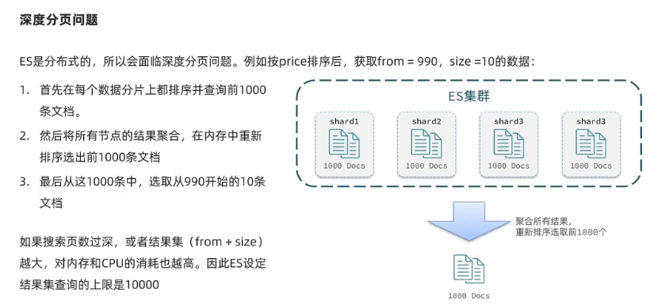

## 十. 分布式搜索---elasticsearch
### 1. 初识elasticsearch
**了解ES**
- elasticsearch是一款非常强大的开源索引引擎, 可以帮我们从海量数据中快速找到需要的内容.
- elasticsearch结合kibana, Logstash, Beats, 也就是elastic stack (ELK). 被广泛应用在日志数据分析, 实时监控等领域
- elasticsearch是elastic stack核心, 负责存储, 搜索. 分析数据


Lucene: 是Apache的开元搜索引擎类库, 提供了搜索引擎的核心API

相比于lucene, elasticsearch具备下列优势:
- 支持分布式, 可水平扩展
- 提供Restful接口, 可被任何语言调用

**正向索引和倒排索引**
elasticsearch采用倒排索引(基于词条创建索引, 再寻找id):
- 文档(document): 每条数据就是一个文档
- 词条(term): 文档按照语义分成的词语


**文档**
elasticsearch是面向文档存储的, 可以是数据库中的一条商品数据, 一个订单信息
文档数据会被序列化成json格式后存储在elasticsearch中

**索引**
- 索引(index): 相同类型的文档的集合
- 映射(mapping): 索引中文档的字段约束信息, 类似表的结构约束
  

Mysql和Elasticsearch概念对比


- Mysql: 擅长事务类型操作, 可以确保数据的安全和一致性
- Elasticsearch: 擅长海量数据的搜索, 分析, 计算

**安装Elasticsearch**

[安装elasticsearch.md](src/main/resources/安装elasticsearch.md)

### 2. 索引库操作
#### (1). mapping映射属性
mapping是对索引库中文档的约束, 常见的mapping属性包括:
- type: 字段数据类型, 常见的简单类型有:
    - 字符串: text(可分词的文本), keyword(精确值, 例如: 品牌, 国家, ip地址)
    - 数值: long, integer, short, byte, double, float
    - 布尔: boolean
    - 日期: date
    - 对象: object
- index: 是否创建索引, 默认为true
- analyzer: 使用哪种分词器
- properties: 该字段的子字段

#### (2). 索引库的CRUD
#### A. 创建索引库 请求内容用DSL语句表示
```edql
PUT /huian
{
  "mappings": {
    "properties": {
      "info": {
        "type": "text",
        "analyzer": "ik_smart"
      },
      "email": {
        "type": "keyword",
        "index": false
      },
      "name": {
        "type": "object",
        "properties": {
          "firstName": {
            "type": "keyword"
          },
          "lastName": {
            "type": "keyword"
          }
        }
      }
    }
  }
}
```
#### B. 查看删除索引库
```edql
GET /indexName

DELETE /indexName
```
#### C. 增加索引库字段
索引库和mapping一旦创建无法修改, 但是可以添加新的字段, 语法如下:
```edql
PUT /indexName/_mapping
{
  "properties": {
    "新字段名": {
      "type": "integer"
    }
  }
}

```
### 3. 文档操作
#### A. 新增文档
```edql
POST /indexName/_doc/doc_id
{
  "字段1": "值1",
  "字段2": "值2",
  "字段3": {
    "子属性1": "值3",
    "子属性2": "值3"
  },
  # ...
}
```
#### B. 查看文档
```edql
GET /indexName/_doc/doc_id
```
#### C. 删除文档
```edql
DELETE /indexName/_doc/doc_id
```
#### D. 修改文档
- 方式一: 全量修改, 会删除旧文档, 添加新文档
```edql
PUT /indexName/_doc/doc_id
{
  "字段1": "值1",
  "字段2": "值2",
  "字段3": {
    "子属性1": "值3",
    "子属性2": "值3"
  },
  # ...
}
```
- 方式二: 增量修改, 修改指定字段值
```edql
POST /indexName/_update/doc_id
{
  "doc": {
    "字段名": "新的值",
    #...
  }
}
```
```edql
POST /huian/_update/1
{
  "doc": {
    "email":"Yun@itstudy.com"
  }
}
```
### 4. RestClient操作索引库(RestAPI)
ES官方提供了各种不同语言的客户端, 用来操作ES. 这些客户端的本质就是组装DSL语句, 通过http发送给ES
#### A. 创建索引库
- 导入项目
- 分析数据结构
  mapping要考虑的问题:
    - 字段名, 数据类型, 是否参与搜索, 是否分词, 如果分词, 分词器是什么

#### B. 初始化JavaRestClient


#### c. 创建索引库

```java
public class HotelIndexTest {
    private final CredentialsProvider credentialsProvider = new BasicCredentialsProvider();
    private RestHighLevelClient client;

    @Test
    void testInit() {
        System.out.println(client);
    }

    /**
     * Description: testCreateHotelIndex 创建索引库
     *
     * @return void
     * @author huian
     * @Date 2023/8/23
     */
    @Test
    void testCreateHotelIndex() throws IOException {
        /*1. 创建Request对象*/
        CreateIndexRequest request = new CreateIndexRequest("hotel");
        /*2. 请求参数, DSL语句(Json风格)*/
        request.source(MAPPING_TEMPLATE, XContentType.JSON);
        /*3. 发送请求*/
        client.indices().create(request, RequestOptions.DEFAULT);

    }


    @BeforeEach
    void setUp() {
        /*初始化客户端设置elasticsearch的http地址*/
        this.credentialsProvider.setCredentials(AuthScope.ANY, new UsernamePasswordCredentials("elastic", "elastic"));
        this.client = new RestHighLevelClient(RestClient.builder(HttpHost.create("http://127.0.0.1:9200")).setHttpClientConfigCallback(
                httpAsyncClientBuilder -> httpAsyncClientBuilder.setDefaultCredentialsProvider(credentialsProvider)));
    }

    @AfterEach
    void tearDown() throws IOException {
        this.client.close();
    }
}
```

#### d. 删除索引库和判断索引库是否存在
- 删除索引库

```java
import org.elasticsearch.action.admin.indices.delete.DeleteIndexRequest;

public class HotelIndexTest {
  @Test
  void testDeleteHotelIndex() throws IOException {
    /*1. 创建Request对象*/
    DeleteIndexRequest request = new DeleteIndexRequest("hotel");
    /*2. 发送请求*/
    client.indices().delete(request, RequestOptions.DEFAULT);
  }
}
```
- 判断索引库是否存在
```java
public class HotelIndexTest {
    @Test
    void testCreateHotelIndex() throws IOException {
        /*1. 创建Request对象*/
        CreateIndexRequest request = new CreateIndexRequest("hotel");
        /*2. 发送请求*/
        boolean exists = client.indices().exists(request, RequestOptions.DEFAULT);
        /*3. 输出*/
        System.out.println(exists);
    }
}
```
### 4. RestClient操作文档
- 初始化JavaRestClient
```java
@SpringBootTest
@SuppressWarnings("all")
public class HotelDocumentTest {
    private final CredentialsProvider credentialsProvider = new BasicCredentialsProvider();
    @Autowired
    private IHotelService hotelService;
    private RestHighLevelClient client;

    @BeforeEach
    void setUp() {
        /*初始化客户端设置elasticsearch的http地址*/
        this.credentialsProvider.setCredentials(AuthScope.ANY, new UsernamePasswordCredentials("elastic", "elastic"));
        this.client = new RestHighLevelClient(RestClient.builder(HttpHost.create("http://127.0.0.1:9200")).setHttpClientConfigCallback(
                httpAsyncClientBuilder -> httpAsyncClientBuilder.setDefaultCredentialsProvider(credentialsProvider)));
    }

    @AfterEach
    void tearDown() throws IOException {
        this.client.close();
    }
}
```
- 利用JavaRestClient新增酒店数据
```java
@SpringBootTest
@SuppressWarnings("all")
public class HotelDocumentTest {
    private final CredentialsProvider credentialsProvider = new BasicCredentialsProvider();
    @Autowired
    private IHotelService hotelService;
    private RestHighLevelClient client;

    @Test
    void testAddDocument() throws IOException {
        /*根据id查询酒店数据*/
        Hotel hotel = hotelService.getById(61083L);
        /*转换为文档类型*/
        HotelDoc hotelDoc = new HotelDoc(hotel);
        /*1. 准备Request对象*/
        IndexRequest request = new IndexRequest("hotel").id(hotelDoc.getId().toString());
        /*2. 准备JSON文档*/
        request.source(JSON.toJSONString(hotelDoc), XContentType.JSON);
        /*3. 发送请求*/
        try {
            client.index(request, RequestOptions.DEFAULT);
        } catch (Exception e) {
            String msg = e.getMessage();
            if (!msg.contains("201 Created") && !msg.contains("200 OK")) {
                throw e;
            }
        }
    }
}
```
- 利用JavaRestClient根据id查询酒店数据
```java
@SpringBootTest
@SuppressWarnings("all")
public class HotelDocumentTest {
    private final CredentialsProvider credentialsProvider = new BasicCredentialsProvider();
    @Autowired
    private IHotelService hotelService;
    private RestHighLevelClient client;

    @Test
    void testGetDocumentById() throws IOException {
        /*1. 准备Request*/
        GetRequest request = new GetRequest("hotel", "61083");
        /*2. 发送请求, 得到响应*/
        GetResponse response = client.get(request, RequestOptions.DEFAULT);
        /*3. 解析响应结果*/
        String json = response.getSourceAsString();
        HotelDoc hotelDoc = JSON.parseObject(json, HotelDoc.class);
        System.out.println(hotelDoc);
    }
}

```
- 利用JavaRestClient删除酒店数据
```java
@SpringBootTest
@SuppressWarnings("all")
public class HotelDocumentTest {
    private final CredentialsProvider credentialsProvider = new BasicCredentialsProvider();
    @Autowired
    private IHotelService hotelService;
    private RestHighLevelClient client;

    @Test
    void testDeleteDocumentById() throws IOException {
        /*1. 准备Request*/
        DeleteRequest request = new DeleteRequest("hotel", "61083");
        /*3. 发送请求*/
        try {
            client.delete(request, RequestOptions.DEFAULT);
        } catch (Exception e) {
            String msg = e.getMessage();
            if (!msg.contains("201 Created") && !msg.contains("200 OK")) {
                throw e;
            }
        }
    }
}
```
- 利用JavaRestClient修改酒店数据
```java
@SpringBootTest
@SuppressWarnings("all")
public class HotelDocumentTest {
    private final CredentialsProvider credentialsProvider = new BasicCredentialsProvider();
    @Autowired
    private IHotelService hotelService;
    private RestHighLevelClient client;

    @Test
    void testUpdateDocumentById() throws IOException {
        /*1. 准备Request*/
        UpdateRequest request = new UpdateRequest("hotel", "61083");
        /*2. 准备请求参数*/
        request.doc(
                "price", "952",
                "starName", "四钻"
        );
        /*3. 发送请求*/
        try {
            client.update(request, RequestOptions.DEFAULT);
        } catch (Exception e) {
            String msg = e.getMessage();
            if (!msg.contains("201 Created") && !msg.contains("200 OK")) {
                throw e;
            }
        }
    }
}
```

**文档操作的基本操作**
- 初始化RestHighLeveClient
- 创建XxxRequest, XXX是Index, GET, Update, Delete
- 准备参数(index和update时需要)
- 发送请求, 调用RestHighLevelClient#.xxx()方法, xxx是index, get, update, delete
- 解析结果 (Get时需要)

**批量操作文档(批量导入稳当)**
1. 利用mybatis-plus查询酒店数据
2. 将查询到的酒店数据(Hotel)转换为稳当类型数据(HotelDoc)
3. 利用JavaRestClient中的Bulk批处理, 实现批量新增稳当
```java
@SpringBootTest
@SuppressWarnings("all")
public class HotelDocumentTest {
    private final CredentialsProvider credentialsProvider = new BasicCredentialsProvider();
    @Autowired
    private IHotelService hotelService;
    private RestHighLevelClient client;

    @Test
    void testBulk() throws IOException {
        /*批量查询酒店数据*/
        List<Hotel> hotels = hotelService.list();

        /*1. 创建Bulk请求*/
        BulkRequest request = new BulkRequest();
        /*2. 准备参数, 添加多个新增的Request*/
        /*转换为稳当类型HotelDoc*/
        for (Hotel hotel : hotels) {
            HotelDoc hotelDoc = new HotelDoc(hotel);
            /*创建新增文档的Request对象*/
            request.add(new IndexRequest("hotel").id(hotelDoc.getId().toString()).
                    source(JSON.toJSONString(hotelDoc), XContentType.JSON));
        }
        /*3. 发送请求*/
        try {
            client.bulk(request, RequestOptions.DEFAULT);
        } catch (Exception e) {
            String msg = e.getMessage();
            if (!msg.contains("201 Created") && !msg.contains("200 OK")) {
                throw e;
            }
        }
    }
}
```

## 十一. 分布式搜索---DSL查询
### 1. DSL查询文档
#### (1). DSL查询分类
基于JSON的DSL(Domain Specific Language)来定义查询, 常见的查询类型包括:
- 查询所有: 查询出所有数据, 一般测试用. 例如match_all
- 全文检索(full text)查询: 利用分词器对用户输入内容分词, 然后去倒排索引库中匹配. 例如:
  - match_query
  - multi_match_query
- 精确查询: 根据精确词条值查找数据, 一般是查找keyword, 数值, 日期, boolean等类型字段. 例如:
  - ids
  - range
  - term
- 地理(geo)查询: 根据经纬度查询, 例如:
  - geo_distance
  - geo_bounding_box
- 复合(compound)查询: 复合查询可以将上述各种查询条件组合起来, 合并查询条件. 例如: 
  - bool
  - function_score

**全文检索查询**
match查询: 对用户输入内容分词, 然后去倒排索引库检索
```edql
GET /hotel/_search
{
  "query":{
    "match": {
      "all": "外滩如家"
    }
  }
}
```
multi_match: 与match查询类似, 只不过允许同时查询多个字段
```edql
GET /hotel/_search
{
  "query": {
    "multi_match": {
      "query": "外滩如家",
      "fields": ["brand", "name","business"]
    }
  }
}
```
match和multi_match的区别是什么?
- match: 根据一个字段查询
- multi_match: 根据多个字段查询, 参与查询字段越多, 查询性能越差

**精确查询**
一般是查找keyword, 数值, 日期, boolean等类型字段, 所以不会对搜索条件分词
- term: 根据词条精确值查询
```edql
GET /hotel/_search 
{
  "query": {
    "term": {
      "city": {
        "value": "上海"
      }
    }
  }
}
```
- range: 根据值的范围查询
```edql
// gt  --> >
// lt  -->  <
// gte  --> >=
// lte  -->  <=
GET /hotel/_search
{
  "query": {
    "range": {
      "price": {
        "gte": 1000,
        "lte": 3000
      }
    }
  }
}

```

**地理查询**
根据经纬度查询. 常见使用场景包括: 
- 携程: 搜索我附近的酒店
- 滴滴: 搜索我附近的出租车
- 微信: 搜索我附近的人


- geo_bounding_box: 查询geo_point值落在某个矩形范围的所有文档
```edql
GET /hotel/_search
{
  "query": {
    "geo_bounding_box": {
      "location": {
        "top_left": {
          "lat": 31.1, 
          "lon": 121.5
        },
        "bottom_right": {
          "lat": 30.9,
          "lon": 121.7
        }
      }
    }
  }
}
```

- geo_distance: 查询到指定中心点小于某个距离值的所有文档
```edql
# distacne查询
GET /hotel/_search
{
  "query":{
    "geo_distance":{
      "distance": "3km",
      "location":  "31.21, 121.5"
    }
  }
}
```

**复合查询Fuction Score Query**

`复合(compound)查询`: 复合查询可以将其它简单查询组合起来, 实现更复杂的搜索逻辑, 例如:
- fuction score: 算分函数查询, 可以控制文档相关性算分, 控制文档排名. 例如百度竞价
- 当我们利用match查询时, 文档结果会根据与搜索词条的关联度打分(_score), 返回结果时按照分值降序排列.


`TF(词条频率) = 词条出现次数 / 文档中词条总数`

`TF-IDF算法(ES5.几版本启用)`


`BM25算法`


`TF-IDF算法和BM25算法区别`


- 案例: 给"如家"这个品牌的酒店排名靠前一些
  1. 那些文档需要算分加权?
     1. 品牌为如家的酒店
  2. 算分函数是什么?
     1. weight就可以
  3. 加权模式是什么?
     1. 求和

```edql
GET /hotel/_search
{
  "query":{
    "function_score": {
      "query": {
        "match": {
          "all": "外滩"
        }
      },
      "functions": [
        {
          "filter": {
            "term": {
              "brand": "如家"
            }
          },
          "weight": 10
        }
      ],
      "boost_mode": "sum"
    }
  }
}

```

**复合查询Boolean Query**
布尔查询是一个或多个查询子句的组合, 子查询的组合方式有:
- must: 必须匹配每个子查询, 类似 "与"
- should: 选择性匹配子查询, 类似 "或"
- must_not: 必须不匹配, 不参与算分, 类似 "非"
- filter: 必须匹配, 不参与算分

- 案例(bool查询实现功能): 搜索名字包含"如家", 价格不高于400, 在坐标31.21, 121.5周围10km范围内的酒店
```edql
GET /hotel/_search
{
  "query": {
    "bool": {
      "must": [
        { 
          "match":{"name": "如家"}
        }
      ],
      "must_not": [ 
        {
          "range":{"price":{"gt":400}}
        }
      ],
      "filter": [
        {
          "geo_distance": {
            "distance": "10km",
            "location": {
              "lat": 31.21,
              "lon": 121.5
            }
          }
        }
      ]
    }
  }
}

```
### 2. DSL查询结果处理
#### (1). 排序

elasticsearch支持对搜索结果排序, 默认是根据相关度算分(_score)来排序的.
可以排序的字段类型有: keyword类型, 数值类型, 地理坐标类型, 日期类型等

- 案例: 对酒店数据按照用户评价降序排列, 评价相同的按照价格升序排序(评价是score字段, 价格是price字段, 按照顺序添加两个排序规则即可)
```edql
GET /hotel/_search
{
  "query": {
    "match_all":{
    }
  },
  "sort": [
    {
      "score": "desc"
    },
    {
      "price": "asc"
    }
  ]
}
```

#### (2). 分页
elasticsearch默认情况下只返回top10的数据, 而如果要查询更多数据就需要修改分页参数了.

elasticsearch中通过修改from, size参数来控制要返回的分页结果:
```edql
GET /hotel/_search
{
    "query": {
        "match_all": {}
    },
  "from": 0, #分页开始的地方
  "size": 50, #希望获取的文档总数
    "sort": [
    {
    "price": "asc"
    }
    ]
}
```
ES是分布式的, 所以会面临深度分页问题, 例如按price排序后, 获取from=990, size=10的数据




针对深度分页, ES提供了两种解决方案
- search after: 分页时需要排序, 原理是从上一次的排序值开始, 查询下一页数据, 官方推荐使用的方式
- scroll: 原理将排序数据形成快照, 保存在内存, 官方已经不推荐使用

#### (3). 高亮
高亮: 就是在搜索结果中把搜索关键字突出显示

原理: 
- 将搜索结果中的关键字用标签标记出来
- 在页面中给标签添加css样式

```edql
# 高亮查询, 默认情况下, ES搜索字段必须与高亮字段一致
GET /hotel/_search
{
  "query": {
    "match": {
      "all": "如家"
    }
  },
  "highlight": {
    "fields": {
      "name":{
        "require_field_match": "false"
      }
    }
  }
}

```

